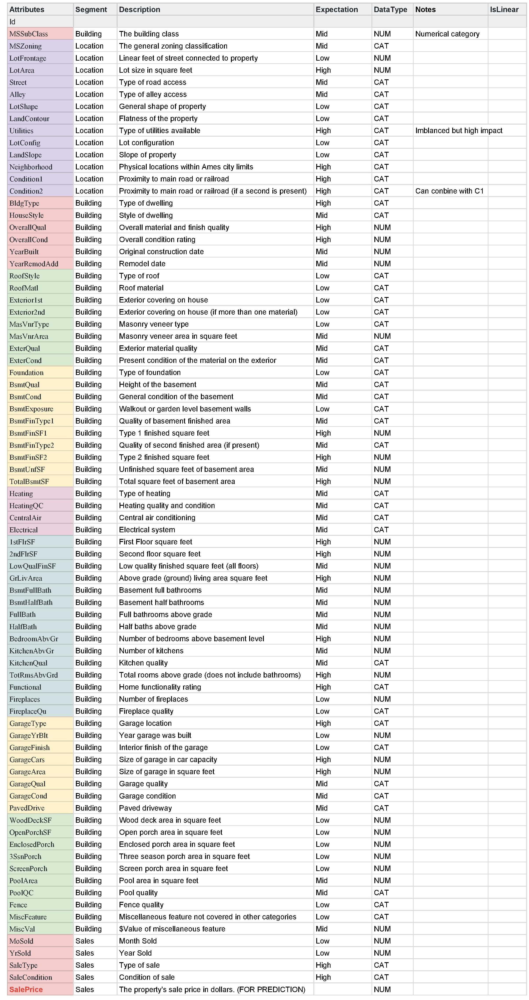

# House-Pricing
https://www.kaggle.com/c/house-prices-advanced-regression-techniques/overview


```python
# 导入相关数据包
import numpy as np
import pandas as pd
import seaborn as sns
import matplotlib.pyplot as plt
%matplotlib inline

from scipy import stats
from scipy.stats import norm
```


```python
root_path = '/opt/data/kaggle/getting-started/house-prices'

train = pd.read_csv('%s/%s' % (root_path, 'train.csv'))
test = pd.read_csv('%s/%s' % (root_path, 'test.csv'))
```

### 特征说明 Feature Description


```python
train.columns
```


    Index(['Id', 'MSSubClass', 'MSZoning', 'LotFrontage', 'LotArea', 'Street',
           'Alley', 'LotShape', 'LandContour', 'Utilities', 'LotConfig',
           'LandSlope', 'Neighborhood', 'Condition1', 'Condition2', 'BldgType',
           'HouseStyle', 'OverallQual', 'OverallCond', 'YearBuilt', 'YearRemodAdd',
           'RoofStyle', 'RoofMatl', 'Exterior1st', 'Exterior2nd', 'MasVnrType',
           'MasVnrArea', 'ExterQual', 'ExterCond', 'Foundation', 'BsmtQual',
           'BsmtCond', 'BsmtExposure', 'BsmtFinType1', 'BsmtFinSF1',
           'BsmtFinType2', 'BsmtFinSF2', 'BsmtUnfSF', 'TotalBsmtSF', 'Heating',
           'HeatingQC', 'CentralAir', 'Electrical', '1stFlrSF', '2ndFlrSF',
           'LowQualFinSF', 'GrLivArea', 'BsmtFullBath', 'BsmtHalfBath', 'FullBath',
           'HalfBath', 'BedroomAbvGr', 'KitchenAbvGr', 'KitchenQual',
           'TotRmsAbvGrd', 'Functional', 'Fireplaces', 'FireplaceQu', 'GarageType',
           'GarageYrBlt', 'GarageFinish', 'GarageCars', 'GarageArea', 'GarageQual',
           'GarageCond', 'PavedDrive', 'WoodDeckSF', 'OpenPorchSF',
           'EnclosedPorch', '3SsnPorch', 'ScreenPorch', 'PoolArea', 'PoolQC',
           'Fence', 'MiscFeature', 'MiscVal', 'MoSold', 'YrSold', 'SaleType',
           'SaleCondition', 'SalePrice'],
          dtype='object')



```python
train.info()
```

    <class 'pandas.core.frame.DataFrame'>
    RangeIndex: 1460 entries, 0 to 1459
    Data columns (total 81 columns):
    Id               1460 non-null int64
    MSSubClass       1460 non-null int64
    MSZoning         1460 non-null object
    LotFrontage      1201 non-null float64
    LotArea          1460 non-null int64
    Street           1460 non-null object
    Alley            91 non-null object
    LotShape         1460 non-null object
    LandContour      1460 non-null object
    Utilities        1460 non-null object
    LotConfig        1460 non-null object
    LandSlope        1460 non-null object
    Neighborhood     1460 non-null object
    Condition1       1460 non-null object
    Condition2       1460 non-null object
    BldgType         1460 non-null object
    HouseStyle       1460 non-null object
    OverallQual      1460 non-null int64
    OverallCond      1460 non-null int64
    YearBuilt        1460 non-null int64
    YearRemodAdd     1460 non-null int64
    RoofStyle        1460 non-null object
    RoofMatl         1460 non-null object
    Exterior1st      1460 non-null object
    Exterior2nd      1460 non-null object
    MasVnrType       1452 non-null object
    MasVnrArea       1452 non-null float64
    ExterQual        1460 non-null object
    ExterCond        1460 non-null object
    Foundation       1460 non-null object
    BsmtQual         1423 non-null object
    BsmtCond         1423 non-null object
    BsmtExposure     1422 non-null object
    BsmtFinType1     1423 non-null object
    BsmtFinSF1       1460 non-null int64
    BsmtFinType2     1422 non-null object
    BsmtFinSF2       1460 non-null int64
    BsmtUnfSF        1460 non-null int64
    TotalBsmtSF      1460 non-null int64
    Heating          1460 non-null object
    HeatingQC        1460 non-null object
    CentralAir       1460 non-null object
    Electrical       1459 non-null object
    1stFlrSF         1460 non-null int64
    2ndFlrSF         1460 non-null int64
    LowQualFinSF     1460 non-null int64
    GrLivArea        1460 non-null int64
    BsmtFullBath     1460 non-null int64
    BsmtHalfBath     1460 non-null int64
    FullBath         1460 non-null int64
    HalfBath         1460 non-null int64
    BedroomAbvGr     1460 non-null int64
    KitchenAbvGr     1460 non-null int64
    KitchenQual      1460 non-null object
    TotRmsAbvGrd     1460 non-null int64
    Functional       1460 non-null object
    Fireplaces       1460 non-null int64
    FireplaceQu      770 non-null object
    GarageType       1379 non-null object
    GarageYrBlt      1379 non-null float64
    GarageFinish     1379 non-null object
    GarageCars       1460 non-null int64
    GarageArea       1460 non-null int64
    GarageQual       1379 non-null object
    GarageCond       1379 non-null object
    PavedDrive       1460 non-null object
    WoodDeckSF       1460 non-null int64
    OpenPorchSF      1460 non-null int64
    EnclosedPorch    1460 non-null int64
    3SsnPorch        1460 non-null int64
    ScreenPorch      1460 non-null int64
    PoolArea         1460 non-null int64
    PoolQC           7 non-null object
    Fence            281 non-null object
    MiscFeature      54 non-null object
    MiscVal          1460 non-null int64
    MoSold           1460 non-null int64
    YrSold           1460 non-null int64
    SaleType         1460 non-null object
    SaleCondition    1460 non-null object
    SalePrice        1460 non-null int64
    dtypes: float64(3), int64(35), object(43)
    memory usage: 924.0+ KB


### 特征详情 Feature Details


```python
train.head(5)
```


<div>
<table border="1" class="dataframe">
  <thead>
    <tr style="text-align: right;">
      <th></th>
      <th>Id</th>
      <th>MSSubClass</th>
      <th>MSZoning</th>
      <th>LotFrontage</th>
      <th>LotArea</th>
      <th>Street</th>
      <th>Alley</th>
      <th>LotShape</th>
      <th>LandContour</th>
      <th>Utilities</th>
      <th>...</th>
      <th>PoolArea</th>
      <th>PoolQC</th>
      <th>Fence</th>
      <th>MiscFeature</th>
      <th>MiscVal</th>
      <th>MoSold</th>
      <th>YrSold</th>
      <th>SaleType</th>
      <th>SaleCondition</th>
      <th>SalePrice</th>
    </tr>
  </thead>
  <tbody>
    <tr>
      <th>0</th>
      <td>1</td>
      <td>60</td>
      <td>RL</td>
      <td>65.0</td>
      <td>8450</td>
      <td>Pave</td>
      <td>NaN</td>
      <td>Reg</td>
      <td>Lvl</td>
      <td>AllPub</td>
      <td>...</td>
      <td>0</td>
      <td>NaN</td>
      <td>NaN</td>
      <td>NaN</td>
      <td>0</td>
      <td>2</td>
      <td>2008</td>
      <td>WD</td>
      <td>Normal</td>
      <td>208500</td>
    </tr>
    <tr>
      <th>1</th>
      <td>2</td>
      <td>20</td>
      <td>RL</td>
      <td>80.0</td>
      <td>9600</td>
      <td>Pave</td>
      <td>NaN</td>
      <td>Reg</td>
      <td>Lvl</td>
      <td>AllPub</td>
      <td>...</td>
      <td>0</td>
      <td>NaN</td>
      <td>NaN</td>
      <td>NaN</td>
      <td>0</td>
      <td>5</td>
      <td>2007</td>
      <td>WD</td>
      <td>Normal</td>
      <td>181500</td>
    </tr>
    <tr>
      <th>2</th>
      <td>3</td>
      <td>60</td>
      <td>RL</td>
      <td>68.0</td>
      <td>11250</td>
      <td>Pave</td>
      <td>NaN</td>
      <td>IR1</td>
      <td>Lvl</td>
      <td>AllPub</td>
      <td>...</td>
      <td>0</td>
      <td>NaN</td>
      <td>NaN</td>
      <td>NaN</td>
      <td>0</td>
      <td>9</td>
      <td>2008</td>
      <td>WD</td>
      <td>Normal</td>
      <td>223500</td>
    </tr>
    <tr>
      <th>3</th>
      <td>4</td>
      <td>70</td>
      <td>RL</td>
      <td>60.0</td>
      <td>9550</td>
      <td>Pave</td>
      <td>NaN</td>
      <td>IR1</td>
      <td>Lvl</td>
      <td>AllPub</td>
      <td>...</td>
      <td>0</td>
      <td>NaN</td>
      <td>NaN</td>
      <td>NaN</td>
      <td>0</td>
      <td>2</td>
      <td>2006</td>
      <td>WD</td>
      <td>Abnorml</td>
      <td>140000</td>
    </tr>
    <tr>
      <th>4</th>
      <td>5</td>
      <td>60</td>
      <td>RL</td>
      <td>84.0</td>
      <td>14260</td>
      <td>Pave</td>
      <td>NaN</td>
      <td>IR1</td>
      <td>Lvl</td>
      <td>AllPub</td>
      <td>...</td>
      <td>0</td>
      <td>NaN</td>
      <td>NaN</td>
      <td>NaN</td>
      <td>0</td>
      <td>12</td>
      <td>2008</td>
      <td>WD</td>
      <td>Normal</td>
      <td>250000</td>
    </tr>
  </tbody>
</table>
<p>5 rows × 81 columns</p>
</div>


### 特征分析 Feature Analysis

每一行是一条房子出售的记录，原始特征有80列，具体的意思可以根据data_description来查询，我们要预测的是房子的售价，即“SalePrice”。训练集有1459条记录，测试集有1460条记录，数据量还是很小的。


```python
# 相关性协方差表,corr()函数,返回结果接近0说明无相关性,大于0说明是正相关,小于0是负相关.
train_corr = train.drop('Id',axis=1).corr()
train_corr
```


<div>
<table border="1" class="dataframe">
  <thead>
    <tr style="text-align: right;">
      <th></th>
      <th>MSSubClass</th>
      <th>LotFrontage</th>
      <th>LotArea</th>
      <th>OverallQual</th>
      <th>OverallCond</th>
      <th>YearBuilt</th>
      <th>YearRemodAdd</th>
      <th>MasVnrArea</th>
      <th>BsmtFinSF1</th>
      <th>BsmtFinSF2</th>
      <th>...</th>
      <th>WoodDeckSF</th>
      <th>OpenPorchSF</th>
      <th>EnclosedPorch</th>
      <th>3SsnPorch</th>
      <th>ScreenPorch</th>
      <th>PoolArea</th>
      <th>MiscVal</th>
      <th>MoSold</th>
      <th>YrSold</th>
      <th>SalePrice</th>
    </tr>
  </thead>
  <tbody>
    <tr>
      <th>MSSubClass</th>
      <td>1.000000</td>
      <td>-0.386347</td>
      <td>-0.139781</td>
      <td>0.032628</td>
      <td>-0.059316</td>
      <td>0.027850</td>
      <td>0.040581</td>
      <td>0.022936</td>
      <td>-0.069836</td>
      <td>-0.065649</td>
      <td>...</td>
      <td>-0.012579</td>
      <td>-0.006100</td>
      <td>-0.012037</td>
      <td>-0.043825</td>
      <td>-0.026030</td>
      <td>0.008283</td>
      <td>-0.007683</td>
      <td>-0.013585</td>
      <td>-0.021407</td>
      <td>-0.084284</td>
    </tr>
    <tr>
      <th>LotFrontage</th>
      <td>-0.386347</td>
      <td>1.000000</td>
      <td>0.426095</td>
      <td>0.251646</td>
      <td>-0.059213</td>
      <td>0.123349</td>
      <td>0.088866</td>
      <td>0.193458</td>
      <td>0.233633</td>
      <td>0.049900</td>
      <td>...</td>
      <td>0.088521</td>
      <td>0.151972</td>
      <td>0.010700</td>
      <td>0.070029</td>
      <td>0.041383</td>
      <td>0.206167</td>
      <td>0.003368</td>
      <td>0.011200</td>
      <td>0.007450</td>
      <td>0.351799</td>
    </tr>
    <tr>
      <th>LotArea</th>
      <td>-0.139781</td>
      <td>0.426095</td>
      <td>1.000000</td>
      <td>0.105806</td>
      <td>-0.005636</td>
      <td>0.014228</td>
      <td>0.013788</td>
      <td>0.104160</td>
      <td>0.214103</td>
      <td>0.111170</td>
      <td>...</td>
      <td>0.171698</td>
      <td>0.084774</td>
      <td>-0.018340</td>
      <td>0.020423</td>
      <td>0.043160</td>
      <td>0.077672</td>
      <td>0.038068</td>
      <td>0.001205</td>
      <td>-0.014261</td>
      <td>0.263843</td>
    </tr>
    <tr>
      <th>OverallQual</th>
      <td>0.032628</td>
      <td>0.251646</td>
      <td>0.105806</td>
      <td>1.000000</td>
      <td>-0.091932</td>
      <td>0.572323</td>
      <td>0.550684</td>
      <td>0.411876</td>
      <td>0.239666</td>
      <td>-0.059119</td>
      <td>...</td>
      <td>0.238923</td>
      <td>0.308819</td>
      <td>-0.113937</td>
      <td>0.030371</td>
      <td>0.064886</td>
      <td>0.065166</td>
      <td>-0.031406</td>
      <td>0.070815</td>
      <td>-0.027347</td>
      <td>0.790982</td>
    </tr>
    <tr>
      <th>OverallCond</th>
      <td>-0.059316</td>
      <td>-0.059213</td>
      <td>-0.005636</td>
      <td>-0.091932</td>
      <td>1.000000</td>
      <td>-0.375983</td>
      <td>0.073741</td>
      <td>-0.128101</td>
      <td>-0.046231</td>
      <td>0.040229</td>
      <td>...</td>
      <td>-0.003334</td>
      <td>-0.032589</td>
      <td>0.070356</td>
      <td>0.025504</td>
      <td>0.054811</td>
      <td>-0.001985</td>
      <td>0.068777</td>
      <td>-0.003511</td>
      <td>0.043950</td>
      <td>-0.077856</td>
    </tr>
    <tr>
      <th>YearBuilt</th>
      <td>0.027850</td>
      <td>0.123349</td>
      <td>0.014228</td>
      <td>0.572323</td>
      <td>-0.375983</td>
      <td>1.000000</td>
      <td>0.592855</td>
      <td>0.315707</td>
      <td>0.249503</td>
      <td>-0.049107</td>
      <td>...</td>
      <td>0.224880</td>
      <td>0.188686</td>
      <td>-0.387268</td>
      <td>0.031355</td>
      <td>-0.050364</td>
      <td>0.004950</td>
      <td>-0.034383</td>
      <td>0.012398</td>
      <td>-0.013618</td>
      <td>0.522897</td>
    </tr>
    <tr>
      <th>YearRemodAdd</th>
      <td>0.040581</td>
      <td>0.088866</td>
      <td>0.013788</td>
      <td>0.550684</td>
      <td>0.073741</td>
      <td>0.592855</td>
      <td>1.000000</td>
      <td>0.179618</td>
      <td>0.128451</td>
      <td>-0.067759</td>
      <td>...</td>
      <td>0.205726</td>
      <td>0.226298</td>
      <td>-0.193919</td>
      <td>0.045286</td>
      <td>-0.038740</td>
      <td>0.005829</td>
      <td>-0.010286</td>
      <td>0.021490</td>
      <td>0.035743</td>
      <td>0.507101</td>
    </tr>
    <tr>
      <th>MasVnrArea</th>
      <td>0.022936</td>
      <td>0.193458</td>
      <td>0.104160</td>
      <td>0.411876</td>
      <td>-0.128101</td>
      <td>0.315707</td>
      <td>0.179618</td>
      <td>1.000000</td>
      <td>0.264736</td>
      <td>-0.072319</td>
      <td>...</td>
      <td>0.159718</td>
      <td>0.125703</td>
      <td>-0.110204</td>
      <td>0.018796</td>
      <td>0.061466</td>
      <td>0.011723</td>
      <td>-0.029815</td>
      <td>-0.005965</td>
      <td>-0.008201</td>
      <td>0.477493</td>
    </tr>
    <tr>
      <th>BsmtFinSF1</th>
      <td>-0.069836</td>
      <td>0.233633</td>
      <td>0.214103</td>
      <td>0.239666</td>
      <td>-0.046231</td>
      <td>0.249503</td>
      <td>0.128451</td>
      <td>0.264736</td>
      <td>1.000000</td>
      <td>-0.050117</td>
      <td>...</td>
      <td>0.204306</td>
      <td>0.111761</td>
      <td>-0.102303</td>
      <td>0.026451</td>
      <td>0.062021</td>
      <td>0.140491</td>
      <td>0.003571</td>
      <td>-0.015727</td>
      <td>0.014359</td>
      <td>0.386420</td>
    </tr>
    <tr>
      <th>BsmtFinSF2</th>
      <td>-0.065649</td>
      <td>0.049900</td>
      <td>0.111170</td>
      <td>-0.059119</td>
      <td>0.040229</td>
      <td>-0.049107</td>
      <td>-0.067759</td>
      <td>-0.072319</td>
      <td>-0.050117</td>
      <td>1.000000</td>
      <td>...</td>
      <td>0.067898</td>
      <td>0.003093</td>
      <td>0.036543</td>
      <td>-0.029993</td>
      <td>0.088871</td>
      <td>0.041709</td>
      <td>0.004940</td>
      <td>-0.015211</td>
      <td>0.031706</td>
      <td>-0.011378</td>
    </tr>
    <tr>
      <th>BsmtUnfSF</th>
      <td>-0.140759</td>
      <td>0.132644</td>
      <td>-0.002618</td>
      <td>0.308159</td>
      <td>-0.136841</td>
      <td>0.149040</td>
      <td>0.181133</td>
      <td>0.114442</td>
      <td>-0.495251</td>
      <td>-0.209294</td>
      <td>...</td>
      <td>-0.005316</td>
      <td>0.129005</td>
      <td>-0.002538</td>
      <td>0.020764</td>
      <td>-0.012579</td>
      <td>-0.035092</td>
      <td>-0.023837</td>
      <td>0.034888</td>
      <td>-0.041258</td>
      <td>0.214479</td>
    </tr>
    <tr>
      <th>TotalBsmtSF</th>
      <td>-0.238518</td>
      <td>0.392075</td>
      <td>0.260833</td>
      <td>0.537808</td>
      <td>-0.171098</td>
      <td>0.391452</td>
      <td>0.291066</td>
      <td>0.363936</td>
      <td>0.522396</td>
      <td>0.104810</td>
      <td>...</td>
      <td>0.232019</td>
      <td>0.247264</td>
      <td>-0.095478</td>
      <td>0.037384</td>
      <td>0.084489</td>
      <td>0.126053</td>
      <td>-0.018479</td>
      <td>0.013196</td>
      <td>-0.014969</td>
      <td>0.613581</td>
    </tr>
    <tr>
      <th>1stFlrSF</th>
      <td>-0.251758</td>
      <td>0.457181</td>
      <td>0.299475</td>
      <td>0.476224</td>
      <td>-0.144203</td>
      <td>0.281986</td>
      <td>0.240379</td>
      <td>0.344501</td>
      <td>0.445863</td>
      <td>0.097117</td>
      <td>...</td>
      <td>0.235459</td>
      <td>0.211671</td>
      <td>-0.065292</td>
      <td>0.056104</td>
      <td>0.088758</td>
      <td>0.131525</td>
      <td>-0.021096</td>
      <td>0.031372</td>
      <td>-0.013604</td>
      <td>0.605852</td>
    </tr>
    <tr>
      <th>2ndFlrSF</th>
      <td>0.307886</td>
      <td>0.080177</td>
      <td>0.050986</td>
      <td>0.295493</td>
      <td>0.028942</td>
      <td>0.010308</td>
      <td>0.140024</td>
      <td>0.174561</td>
      <td>-0.137079</td>
      <td>-0.099260</td>
      <td>...</td>
      <td>0.092165</td>
      <td>0.208026</td>
      <td>0.061989</td>
      <td>-0.024358</td>
      <td>0.040606</td>
      <td>0.081487</td>
      <td>0.016197</td>
      <td>0.035164</td>
      <td>-0.028700</td>
      <td>0.319334</td>
    </tr>
    <tr>
      <th>LowQualFinSF</th>
      <td>0.046474</td>
      <td>0.038469</td>
      <td>0.004779</td>
      <td>-0.030429</td>
      <td>0.025494</td>
      <td>-0.183784</td>
      <td>-0.062419</td>
      <td>-0.069071</td>
      <td>-0.064503</td>
      <td>0.014807</td>
      <td>...</td>
      <td>-0.025444</td>
      <td>0.018251</td>
      <td>0.061081</td>
      <td>-0.004296</td>
      <td>0.026799</td>
      <td>0.062157</td>
      <td>-0.003793</td>
      <td>-0.022174</td>
      <td>-0.028921</td>
      <td>-0.025606</td>
    </tr>
    <tr>
      <th>GrLivArea</th>
      <td>0.074853</td>
      <td>0.402797</td>
      <td>0.263116</td>
      <td>0.593007</td>
      <td>-0.079686</td>
      <td>0.199010</td>
      <td>0.287389</td>
      <td>0.390857</td>
      <td>0.208171</td>
      <td>-0.009640</td>
      <td>...</td>
      <td>0.247433</td>
      <td>0.330224</td>
      <td>0.009113</td>
      <td>0.020643</td>
      <td>0.101510</td>
      <td>0.170205</td>
      <td>-0.002416</td>
      <td>0.050240</td>
      <td>-0.036526</td>
      <td>0.708624</td>
    </tr>
    <tr>
      <th>BsmtFullBath</th>
      <td>0.003491</td>
      <td>0.100949</td>
      <td>0.158155</td>
      <td>0.111098</td>
      <td>-0.054942</td>
      <td>0.187599</td>
      <td>0.119470</td>
      <td>0.085310</td>
      <td>0.649212</td>
      <td>0.158678</td>
      <td>...</td>
      <td>0.175315</td>
      <td>0.067341</td>
      <td>-0.049911</td>
      <td>-0.000106</td>
      <td>0.023148</td>
      <td>0.067616</td>
      <td>-0.023047</td>
      <td>-0.025361</td>
      <td>0.067049</td>
      <td>0.227122</td>
    </tr>
    <tr>
      <th>BsmtHalfBath</th>
      <td>-0.002333</td>
      <td>-0.007234</td>
      <td>0.048046</td>
      <td>-0.040150</td>
      <td>0.117821</td>
      <td>-0.038162</td>
      <td>-0.012337</td>
      <td>0.026673</td>
      <td>0.067418</td>
      <td>0.070948</td>
      <td>...</td>
      <td>0.040161</td>
      <td>-0.025324</td>
      <td>-0.008555</td>
      <td>0.035114</td>
      <td>0.032121</td>
      <td>0.020025</td>
      <td>-0.007367</td>
      <td>0.032873</td>
      <td>-0.046524</td>
      <td>-0.016844</td>
    </tr>
    <tr>
      <th>FullBath</th>
      <td>0.131608</td>
      <td>0.198769</td>
      <td>0.126031</td>
      <td>0.550600</td>
      <td>-0.194149</td>
      <td>0.468271</td>
      <td>0.439046</td>
      <td>0.276833</td>
      <td>0.058543</td>
      <td>-0.076444</td>
      <td>...</td>
      <td>0.187703</td>
      <td>0.259977</td>
      <td>-0.115093</td>
      <td>0.035353</td>
      <td>-0.008106</td>
      <td>0.049604</td>
      <td>-0.014290</td>
      <td>0.055872</td>
      <td>-0.019669</td>
      <td>0.560664</td>
    </tr>
    <tr>
      <th>HalfBath</th>
      <td>0.177354</td>
      <td>0.053532</td>
      <td>0.014259</td>
      <td>0.273458</td>
      <td>-0.060769</td>
      <td>0.242656</td>
      <td>0.183331</td>
      <td>0.201444</td>
      <td>0.004262</td>
      <td>-0.032148</td>
      <td>...</td>
      <td>0.108080</td>
      <td>0.199740</td>
      <td>-0.095317</td>
      <td>-0.004972</td>
      <td>0.072426</td>
      <td>0.022381</td>
      <td>0.001290</td>
      <td>-0.009050</td>
      <td>-0.010269</td>
      <td>0.284108</td>
    </tr>
    <tr>
      <th>BedroomAbvGr</th>
      <td>-0.023438</td>
      <td>0.263170</td>
      <td>0.119690</td>
      <td>0.101676</td>
      <td>0.012980</td>
      <td>-0.070651</td>
      <td>-0.040581</td>
      <td>0.102821</td>
      <td>-0.107355</td>
      <td>-0.015728</td>
      <td>...</td>
      <td>0.046854</td>
      <td>0.093810</td>
      <td>0.041570</td>
      <td>-0.024478</td>
      <td>0.044300</td>
      <td>0.070703</td>
      <td>0.007767</td>
      <td>0.046544</td>
      <td>-0.036014</td>
      <td>0.168213</td>
    </tr>
    <tr>
      <th>KitchenAbvGr</th>
      <td>0.281721</td>
      <td>-0.006069</td>
      <td>-0.017784</td>
      <td>-0.183882</td>
      <td>-0.087001</td>
      <td>-0.174800</td>
      <td>-0.149598</td>
      <td>-0.037610</td>
      <td>-0.081007</td>
      <td>-0.040751</td>
      <td>...</td>
      <td>-0.090130</td>
      <td>-0.070091</td>
      <td>0.037312</td>
      <td>-0.024600</td>
      <td>-0.051613</td>
      <td>-0.014525</td>
      <td>0.062341</td>
      <td>0.026589</td>
      <td>0.031687</td>
      <td>-0.135907</td>
    </tr>
    <tr>
      <th>TotRmsAbvGrd</th>
      <td>0.040380</td>
      <td>0.352096</td>
      <td>0.190015</td>
      <td>0.427452</td>
      <td>-0.057583</td>
      <td>0.095589</td>
      <td>0.191740</td>
      <td>0.280682</td>
      <td>0.044316</td>
      <td>-0.035227</td>
      <td>...</td>
      <td>0.165984</td>
      <td>0.234192</td>
      <td>0.004151</td>
      <td>-0.006683</td>
      <td>0.059383</td>
      <td>0.083757</td>
      <td>0.024763</td>
      <td>0.036907</td>
      <td>-0.034516</td>
      <td>0.533723</td>
    </tr>
    <tr>
      <th>Fireplaces</th>
      <td>-0.045569</td>
      <td>0.266639</td>
      <td>0.271364</td>
      <td>0.396765</td>
      <td>-0.023820</td>
      <td>0.147716</td>
      <td>0.112581</td>
      <td>0.249070</td>
      <td>0.260011</td>
      <td>0.046921</td>
      <td>...</td>
      <td>0.200019</td>
      <td>0.169405</td>
      <td>-0.024822</td>
      <td>0.011257</td>
      <td>0.184530</td>
      <td>0.095074</td>
      <td>0.001409</td>
      <td>0.046357</td>
      <td>-0.024096</td>
      <td>0.466929</td>
    </tr>
    <tr>
      <th>GarageYrBlt</th>
      <td>0.085072</td>
      <td>0.070250</td>
      <td>-0.024947</td>
      <td>0.547766</td>
      <td>-0.324297</td>
      <td>0.825667</td>
      <td>0.642277</td>
      <td>0.252691</td>
      <td>0.153484</td>
      <td>-0.088011</td>
      <td>...</td>
      <td>0.224577</td>
      <td>0.228425</td>
      <td>-0.297003</td>
      <td>0.023544</td>
      <td>-0.075418</td>
      <td>-0.014501</td>
      <td>-0.032417</td>
      <td>0.005337</td>
      <td>-0.001014</td>
      <td>0.486362</td>
    </tr>
    <tr>
      <th>GarageCars</th>
      <td>-0.040110</td>
      <td>0.285691</td>
      <td>0.154871</td>
      <td>0.600671</td>
      <td>-0.185758</td>
      <td>0.537850</td>
      <td>0.420622</td>
      <td>0.364204</td>
      <td>0.224054</td>
      <td>-0.038264</td>
      <td>...</td>
      <td>0.226342</td>
      <td>0.213569</td>
      <td>-0.151434</td>
      <td>0.035765</td>
      <td>0.050494</td>
      <td>0.020934</td>
      <td>-0.043080</td>
      <td>0.040522</td>
      <td>-0.039117</td>
      <td>0.640409</td>
    </tr>
    <tr>
      <th>GarageArea</th>
      <td>-0.098672</td>
      <td>0.344997</td>
      <td>0.180403</td>
      <td>0.562022</td>
      <td>-0.151521</td>
      <td>0.478954</td>
      <td>0.371600</td>
      <td>0.373066</td>
      <td>0.296970</td>
      <td>-0.018227</td>
      <td>...</td>
      <td>0.224666</td>
      <td>0.241435</td>
      <td>-0.121777</td>
      <td>0.035087</td>
      <td>0.051412</td>
      <td>0.061047</td>
      <td>-0.027400</td>
      <td>0.027974</td>
      <td>-0.027378</td>
      <td>0.623431</td>
    </tr>
    <tr>
      <th>WoodDeckSF</th>
      <td>-0.012579</td>
      <td>0.088521</td>
      <td>0.171698</td>
      <td>0.238923</td>
      <td>-0.003334</td>
      <td>0.224880</td>
      <td>0.205726</td>
      <td>0.159718</td>
      <td>0.204306</td>
      <td>0.067898</td>
      <td>...</td>
      <td>1.000000</td>
      <td>0.058661</td>
      <td>-0.125989</td>
      <td>-0.032771</td>
      <td>-0.074181</td>
      <td>0.073378</td>
      <td>-0.009551</td>
      <td>0.021011</td>
      <td>0.022270</td>
      <td>0.324413</td>
    </tr>
    <tr>
      <th>OpenPorchSF</th>
      <td>-0.006100</td>
      <td>0.151972</td>
      <td>0.084774</td>
      <td>0.308819</td>
      <td>-0.032589</td>
      <td>0.188686</td>
      <td>0.226298</td>
      <td>0.125703</td>
      <td>0.111761</td>
      <td>0.003093</td>
      <td>...</td>
      <td>0.058661</td>
      <td>1.000000</td>
      <td>-0.093079</td>
      <td>-0.005842</td>
      <td>0.074304</td>
      <td>0.060762</td>
      <td>-0.018584</td>
      <td>0.071255</td>
      <td>-0.057619</td>
      <td>0.315856</td>
    </tr>
    <tr>
      <th>EnclosedPorch</th>
      <td>-0.012037</td>
      <td>0.010700</td>
      <td>-0.018340</td>
      <td>-0.113937</td>
      <td>0.070356</td>
      <td>-0.387268</td>
      <td>-0.193919</td>
      <td>-0.110204</td>
      <td>-0.102303</td>
      <td>0.036543</td>
      <td>...</td>
      <td>-0.125989</td>
      <td>-0.093079</td>
      <td>1.000000</td>
      <td>-0.037305</td>
      <td>-0.082864</td>
      <td>0.054203</td>
      <td>0.018361</td>
      <td>-0.028887</td>
      <td>-0.009916</td>
      <td>-0.128578</td>
    </tr>
    <tr>
      <th>3SsnPorch</th>
      <td>-0.043825</td>
      <td>0.070029</td>
      <td>0.020423</td>
      <td>0.030371</td>
      <td>0.025504</td>
      <td>0.031355</td>
      <td>0.045286</td>
      <td>0.018796</td>
      <td>0.026451</td>
      <td>-0.029993</td>
      <td>...</td>
      <td>-0.032771</td>
      <td>-0.005842</td>
      <td>-0.037305</td>
      <td>1.000000</td>
      <td>-0.031436</td>
      <td>-0.007992</td>
      <td>0.000354</td>
      <td>0.029474</td>
      <td>0.018645</td>
      <td>0.044584</td>
    </tr>
    <tr>
      <th>ScreenPorch</th>
      <td>-0.026030</td>
      <td>0.041383</td>
      <td>0.043160</td>
      <td>0.064886</td>
      <td>0.054811</td>
      <td>-0.050364</td>
      <td>-0.038740</td>
      <td>0.061466</td>
      <td>0.062021</td>
      <td>0.088871</td>
      <td>...</td>
      <td>-0.074181</td>
      <td>0.074304</td>
      <td>-0.082864</td>
      <td>-0.031436</td>
      <td>1.000000</td>
      <td>0.051307</td>
      <td>0.031946</td>
      <td>0.023217</td>
      <td>0.010694</td>
      <td>0.111447</td>
    </tr>
    <tr>
      <th>PoolArea</th>
      <td>0.008283</td>
      <td>0.206167</td>
      <td>0.077672</td>
      <td>0.065166</td>
      <td>-0.001985</td>
      <td>0.004950</td>
      <td>0.005829</td>
      <td>0.011723</td>
      <td>0.140491</td>
      <td>0.041709</td>
      <td>...</td>
      <td>0.073378</td>
      <td>0.060762</td>
      <td>0.054203</td>
      <td>-0.007992</td>
      <td>0.051307</td>
      <td>1.000000</td>
      <td>0.029669</td>
      <td>-0.033737</td>
      <td>-0.059689</td>
      <td>0.092404</td>
    </tr>
    <tr>
      <th>MiscVal</th>
      <td>-0.007683</td>
      <td>0.003368</td>
      <td>0.038068</td>
      <td>-0.031406</td>
      <td>0.068777</td>
      <td>-0.034383</td>
      <td>-0.010286</td>
      <td>-0.029815</td>
      <td>0.003571</td>
      <td>0.004940</td>
      <td>...</td>
      <td>-0.009551</td>
      <td>-0.018584</td>
      <td>0.018361</td>
      <td>0.000354</td>
      <td>0.031946</td>
      <td>0.029669</td>
      <td>1.000000</td>
      <td>-0.006495</td>
      <td>0.004906</td>
      <td>-0.021190</td>
    </tr>
    <tr>
      <th>MoSold</th>
      <td>-0.013585</td>
      <td>0.011200</td>
      <td>0.001205</td>
      <td>0.070815</td>
      <td>-0.003511</td>
      <td>0.012398</td>
      <td>0.021490</td>
      <td>-0.005965</td>
      <td>-0.015727</td>
      <td>-0.015211</td>
      <td>...</td>
      <td>0.021011</td>
      <td>0.071255</td>
      <td>-0.028887</td>
      <td>0.029474</td>
      <td>0.023217</td>
      <td>-0.033737</td>
      <td>-0.006495</td>
      <td>1.000000</td>
      <td>-0.145721</td>
      <td>0.046432</td>
    </tr>
    <tr>
      <th>YrSold</th>
      <td>-0.021407</td>
      <td>0.007450</td>
      <td>-0.014261</td>
      <td>-0.027347</td>
      <td>0.043950</td>
      <td>-0.013618</td>
      <td>0.035743</td>
      <td>-0.008201</td>
      <td>0.014359</td>
      <td>0.031706</td>
      <td>...</td>
      <td>0.022270</td>
      <td>-0.057619</td>
      <td>-0.009916</td>
      <td>0.018645</td>
      <td>0.010694</td>
      <td>-0.059689</td>
      <td>0.004906</td>
      <td>-0.145721</td>
      <td>1.000000</td>
      <td>-0.028923</td>
    </tr>
    <tr>
      <th>SalePrice</th>
      <td>-0.084284</td>
      <td>0.351799</td>
      <td>0.263843</td>
      <td>0.790982</td>
      <td>-0.077856</td>
      <td>0.522897</td>
      <td>0.507101</td>
      <td>0.477493</td>
      <td>0.386420</td>
      <td>-0.011378</td>
      <td>...</td>
      <td>0.324413</td>
      <td>0.315856</td>
      <td>-0.128578</td>
      <td>0.044584</td>
      <td>0.111447</td>
      <td>0.092404</td>
      <td>-0.021190</td>
      <td>0.046432</td>
      <td>-0.028923</td>
      <td>1.000000</td>
    </tr>
  </tbody>
</table>
<p>37 rows × 37 columns</p>
</div>
